앱의 응답성을 높이기위한 네트워킹 지연 단축

# Latency matter

네트워크 대기 시간은 데이터가 하나의 엔드포인트에서 다른 엔드포인트로 가는 데 걸리는 시간을 말합니다

모든 앱은 네트워크 처리 속도가 느리면 앱 사용 경험의 질이 떨어짐

</br>

## Where are my app’s packets?

앱이 서버에서 데이터를 요청하면 네트워킹 스택에서 패킷이 전송됨

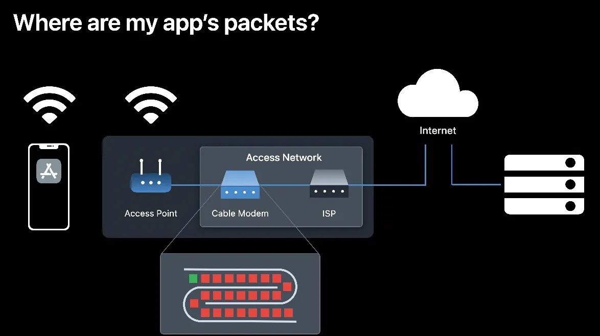

현실에서는 네트워크상 가장 느린 연결에 패킷이 처리되지 못하고 길게 줄을 서 있음

우리의 앱 데이터패킷은 실제로 이 긴줄뒤에서 앞의패킷이 처리되길 기다림

가장 느린 연결의 대기 줄이 앱과 서버 간의 데이터 왕복 시간을 늘림

앱의 응답성은 두 가지 계수의 곱으로 결정됨

**1회 왕복 소요 시간 X 왕복 횟수**

이 계수를 줄이면 앱의 대기 시간이 줄어들고 앱의 응답성이 커짐

</br>

첫 번째 실험에서는 **대기 시간을 고정**하고 대역폭을 초당 1MB부터 10MB까지 늘림

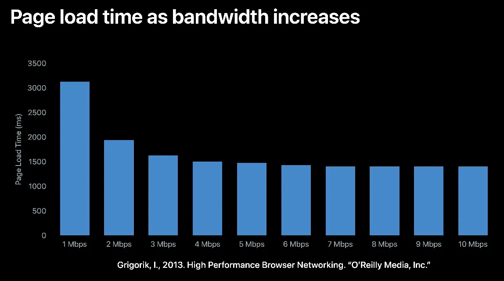

처음에 대역폭을 1MB에서 2MB로 늘렸을 땐 페이지 로딩 시간이 거의 40% 가까이 감소

하지만 4MB 이상부터는 대역폭이 조금씩 증가해도 페이지 로딩 시간은 거의 개선되지 않음

기가바이트 수준의 인터넷으로 업그레이드를 해도 앱이 느릴 수 있음

</br>

다음 실험으로는 **대기 시간(latency)을 축소**

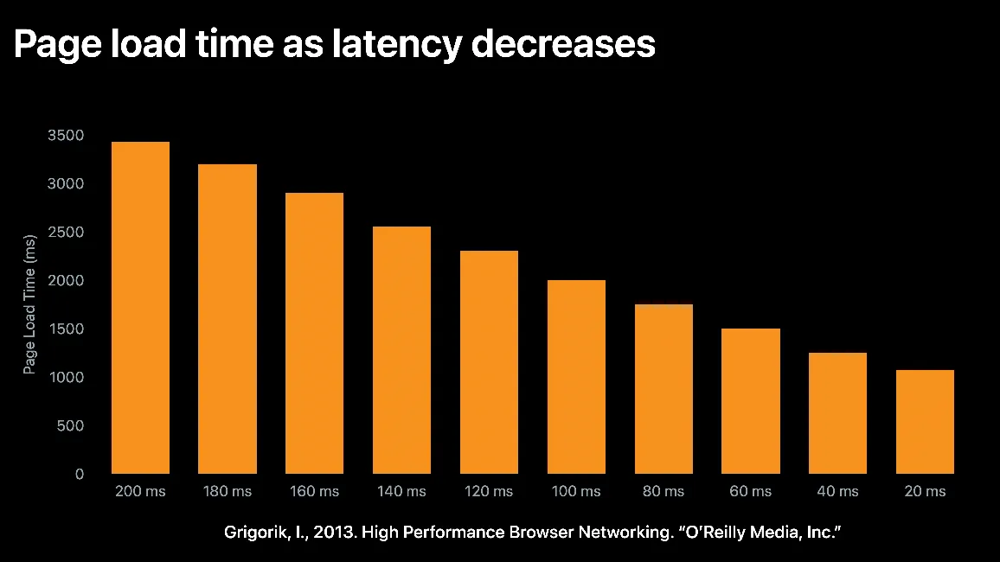

20밀리초가 줄어들 때마다 페이지 로딩 시간이 선형 감소하는 효과가 있음

이런 실험 결과는 앱의 모든 네트워크 활동에 적용됨

-> 성능좋은 장비를 사용하는거보다 앱의 대기 시간을 줄이는게 최고 👍

</br>

# Design responsive apps

IPv6나 TLS 1.3 HTTP/3 같은 최신 프로토콜을 적용하면 앱의 대기 시간을 상당히 줄일 수 있음

앱에서 URLSession과 Network.framework API를 사용하기만 하면 됨

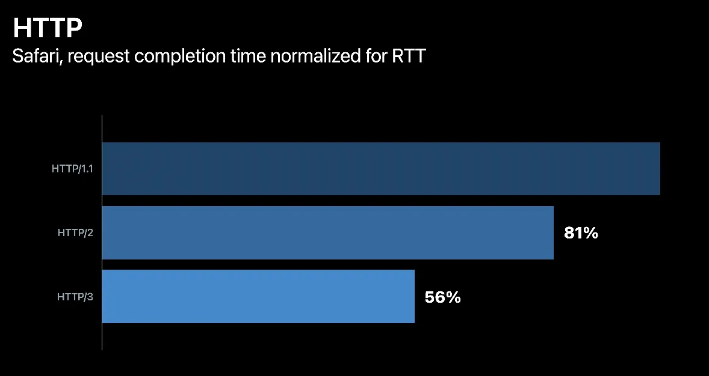

다른 HTTP 버전들과 사파리 트래픽을 비교하면 HTTP/3가 그중에서 가장 빠름

> HTTP/3이란?

HTTP/3은 QUIC이라는 이름으로 구글에서 개발됨, 이후 표준화되면서 HHTP/3으로 변경됨

이전버전까지는 TCP기반이엿음

> QUIC?

**구글이 개발한 전송 계층 프로토콜**로, UDP(User Datagram Protocol) 위에서 구현된 다중 전송 프로토콜 HTTP/3의 전송 계층으로 사용되며, TCP 대신 사용할 수 있음

```
⚙️ vs http2

→ zero RTT(round Trip Time) 이미 연결된 서버인경우 핸드셰이크 건너뜀

→ 패킷 손실에 대한 빠른 대응

→ 사용자 IP변경시에도 연결 유지(서로다른 네트워크간 마이그레이션 가능함)

→ 일반적인 웹환경은 비슷하나 영상서비스에서는 큰차이를 나타냄

→ TLS암호화를 기본으로 사용

```

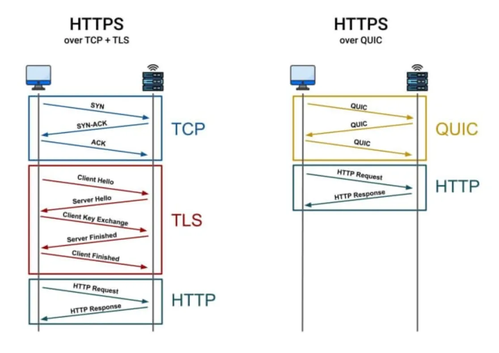

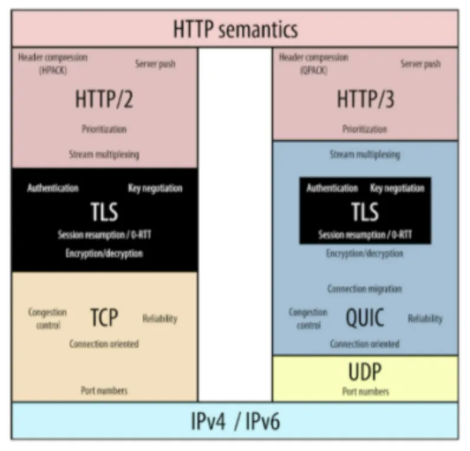

</br>

---

장치가 Wi-Fi에서 셀룰러로 옮겨 갈 때 새 연결을 다시 설정하려면 시간이 걸림

이때 앱이 멈출 수 있는데 Connection migration을 이용해 이런 멈춤 현상을 제거가능함

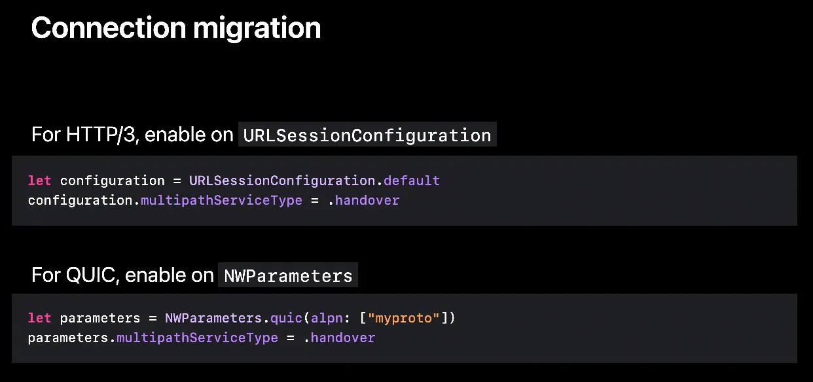

기능을 적용을 위해 URLSession Configuration이나 NWParameters의 multipathServiceType 프로퍼티를 .handover로 설정합니다

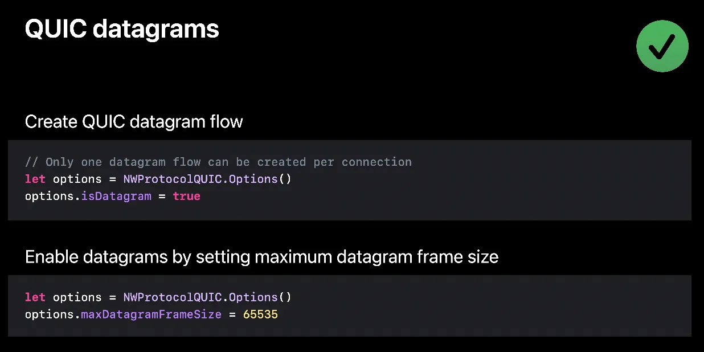

iOS 16과 macOS Ventura에선 데이터그램을 전송하는 더 나은 방법을 도입함

QUIC datagram은 일반 UDP에 비해 이점이 많음

- QUIC 데이터그램이 네트워크 혼잡에 반응할 수 있음(중요)
- 네트워크 왕복 시간은 줄이고 패킷 손실은 줄일 수 있음

클라이언트에 적용하기 위해 QUIC 옵션에서 isDatagram을 true로 설정하고 여러분이 원하는 데이터그램의 최대 프레임 크기를 설정합니다

데이터그램 흐름을 만든 이후에는 다른 QUIC 스트림처럼 주고받을 수 있습니다

</br>

# Speed up your server

[https://github.com/network-quality/server](https://github.com/network-quality/server)

monterey부터 맥북에서 사용가능(포함 되잇음)

아이폰에도 개발자 모드탭에 구현되있음

서버에서도 위의 툴을 이용해서 버퍼블로트 측정가능

```swift
# 내컴퓨터 측정
networkQuality

# 원하는 엔드포인트 측정가능(해당 서버에 도구있어야함)
networkQuality -C <https://networkquality.example.com/config> 

# 출력예시
==== SUMMARY ====
Upload capacity: 29.662 Mbps
Download capacity: 541.622 Mbps
Upload flows: 12
Download flows: 12
Responsiveness: High (1825 RPM) // RPM: 분당 왕복 수
```

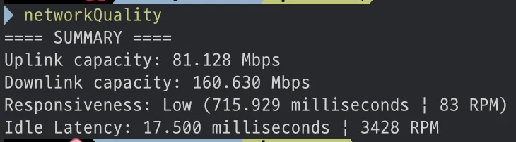

</br>

> 버퍼블로트(bufferbloat)

네트워크 장비가 과부하되지 않게 하는 트래픽 관리 시스템이 속도 저하 원인됨

이문제를 버퍼블로트라함

네트워크에 있는 장치와 처리해야 하는 트래픽량은 항상 변하기 때문에 한 번에 전송해야 하는 데이터량을 실제로 파악하는 컴퓨터가 없다

이에 대응하기 위해 네트워크 기기에는 버퍼가 설치되어 있다

이 버퍼가 커지고 있다는 게 기존 인터넷에서 문제가 되고 있다.

버퍼에 의해 발생하는 지연이 큰 문제

처음엔 Apple의 기본 서버를 측정하고 다음엔 여러분이 구성한 서버를 측정했을때

점수가 기본 서버에선 높은데 여러분의 서버에선 높지 않다면 여러분 서버의 응답성을 개선할 여지가 있는것

</br>

### 예시 - Make streaming more responsive

영상 일부를 건너뛰고 다른 지점을 재생했을 때 버퍼링되느라 한참을 기다린 경험이 있을것이다

이렇게 임의로 접근하면 왜 느려지는지 이유를 조사해봄

→ 응답성 점수가 낮다는걸 발견

→ 네트워크 품질도구를 이용해서 서버에 엄청난 대기열 있는것을 발견

서버구성중 TCP, TLS, HTTP 버퍼크기를 알아봄

TCP(Transport) - 4MB

TLS(Security) - 256KB

HTTP(Application) - 4MB

로 구성되있음

램용량이 충분해서 버퍼크기가 컸음

</br>

**큰 버퍼의 오래된 데이터 뒤에 새로 생성된 패킷이 대기하면서 이 새로운 패킷을 전달하는데 추가적인 지연이 많이 발생함**

</br>

그래서 버퍼크기를

TCP(Transport) - 256KB

TLS(Security) - 16KB

HTTP(Application) - 128KB

로 줄임

| 변경전                                      | 변경후                                 |
| :----------------------------------------: | :-----------------------------------: |
| 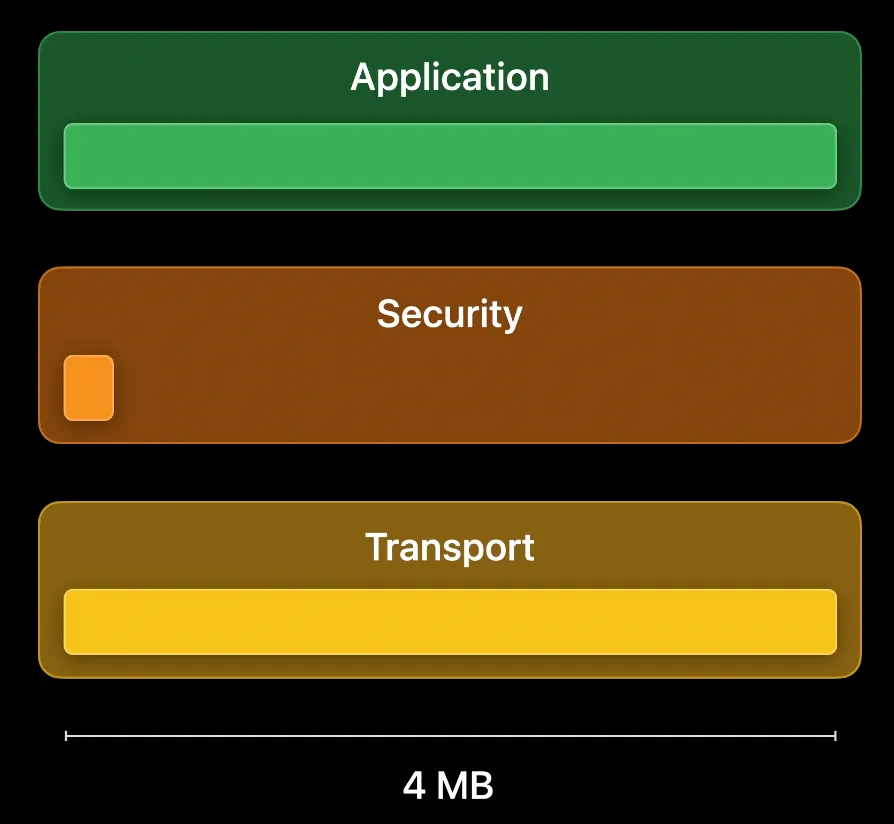<br> | 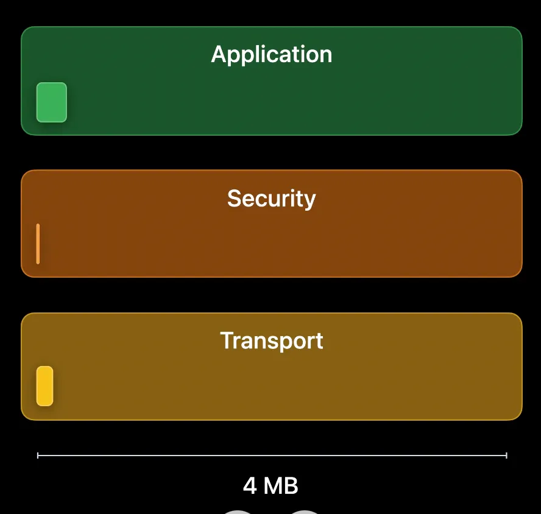 |

이렇게 변경후 다시측정

이번엔 RPM점수가 높음

같은영상을 재생했고 영상을 뒤로 건너뛰어도 버퍼링되지않고 즉시 재생됨

**서버에서 불필요한 대기열을 없애면서 접근 응답이 훨씬 빨라짐**

서버를 이렇게 변경하면 앱이 네트워크를 사용하는 방식에 관계없이 응답성이 향상되고 사용자환경이 좋아질것

아파치 트래픽 서버의 옵션 구성파일

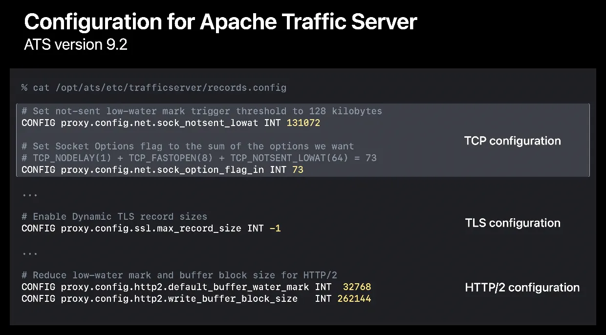

TCP 128kb, TLS는 동적크기, HTTP/2도 버퍼값을 줄임, apache에도 이런 구성을 권장함

</br>

# Speed up the network

Apple은 iOS 15과 macOS Monterey에 네트워크 품질 도구를 도입

그이후 이것을 이용한 다양한 오픈소스들 존재함

네트워크 지연을 파악하는 가장 좋은 방법은 지연에 민감한 앱을 사용해 보는 것

원격 컴퓨터와 화면공유로 테스트

두 컴퓨터의 시각이 동일하게 표시되는데도 원격 화면에선 제때 업데이트가 안 되고 시각이 몇 초 정도 지연돼서 표시됨

이문제를 해결하기위해 Apple은 **L4S** 라는 기술을 개발함

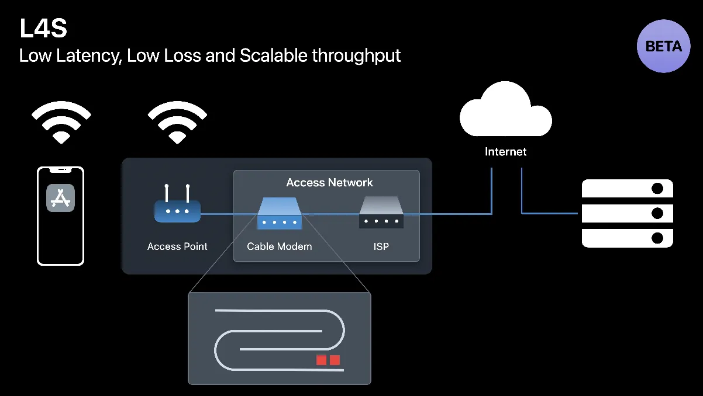

</br>

> L4S(Low Latency, Low Loss, Scalable Throughput) 이란?

기존 인터넷의 **버퍼블로트(Bufferbloat) 문제를 해결하고**, 대기 시간이 중요한 실시간 애플리케이션(예: 클라우드 게이밍, AR/VR, 원격 협업, 자율주행)에서 보다 안정적인 네트워크 환경을 제공하기 위해 개발됨

ECN(Explicit Congestion Notification, 명시적 혼잡 알림)을 이용해 패킷손실없이 네트워크상태 조정

Apple은 iOS 17 및 macOS Sonoma 사용자에게 L4S 지원을 무작위로 출시함

</br>

---

L4S는 대기 지연 시간을 상당히 줄여 주고 네트워크 정체 중에 일어나는 손실도 없음

짧은 대기열을 계속 유지하기 위해 네트워크는 패킷을 삭제하는 대신 정체를 명시하여 알리고 이 네트워크 정체 피드백에 따라 송신자가 전송 속도를 조정

이렇게 하면 패킷 손실 없이 네트워크의 대기열을 짧게 유지할 수 있고 덕분에 앱의 응답성이 높아짐

L4S를 적용한 네트워크를 사용한 양쪽 컴퓨터에서 시계 앱을 켜면 이번엔 로컬 컴퓨터 화면과 원격 공유 화면의 시계가 완벽하게 일치함

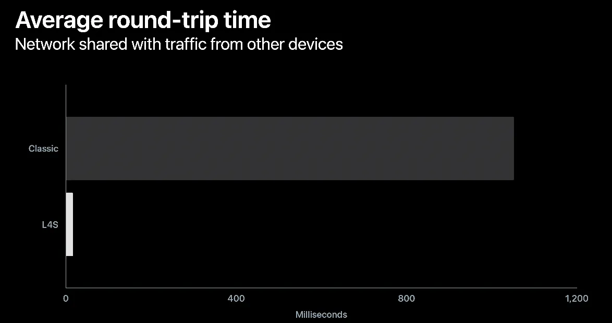

기존의 대기열과 L4S를 비교했을 때 L4S를 적용하면 왕복 시간에서 엄청난 감소를 확인할 수 있음

</br>

적용을위한 코드변경 없음 → 인프라가 지원되야함(네트워크장비가 ECN을 지원, 송수신기 소프트웨어가 ECN기반 알고리즘을 사용해야함)

L4S는 자동지원됨

서버나 CDN제공자가 앱서버에서 지원해야함!
