# [WWDC2024] Demystify SwiftUI containers

iOS 18 상위 버전에서 컬렉션 관련된 커스텀뷰나 컴포넌트를 만들때 자주 사용되는

Group에서 새로 제공되는 이니셜라이저 Group(contentsOf:)가 궁금해서 찾아보게 됐습니다🫡

Container View는 Trailing View Builder Closure로 콘텐츠를 래핑합니다.

우리가 알고있는 List Container View 또한 마찬가지입니다.

## List 기본 사용법


### 클로저에 하드코딩 하는 방법 (정적)


```swift
List {
	Text("Scrolling in the Deep")
    Text("Born to Build & Run")
    Text("Some Body Like View")
}
```

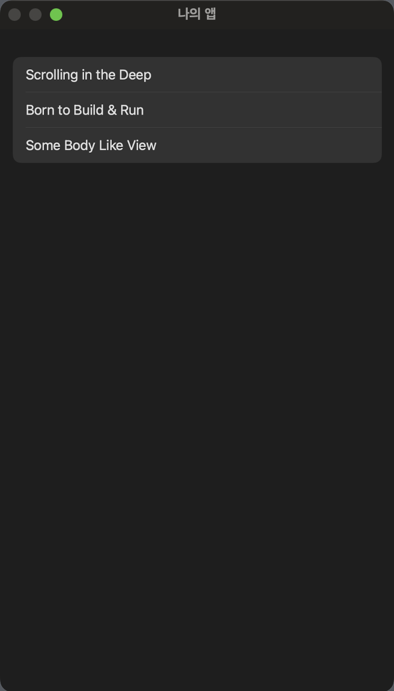


### 배열과 ForEach를 사용하는 방법 (동적)

```swift
@State var otherSongs: [Song] = [
    .init(title: "Cupertino Dreamin'"),
    .init(title: "They See Me Scrollin'"),
    .init(title: "A Whole View World"),
    .init(title: "Come as You Var")
]

List {
		Text("Scrolling in the Deep")
    Text("Born to Build & Run")
    Text("Some Body Like View")
    
    ForEach(otherSongs) { song in
		    Text(song.title)
		}
}
```

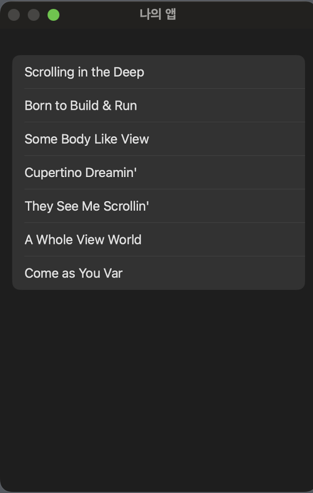


## List 고급?기능


### 섹션으로 그룹화

```swift
List {
	  Section("Favorite Songs") {
		    Text("Scrolling in the Deep")
		    Text("Born to Build & Run")
		    Text("Some Body Like View")
	  }

	  Section("Other Songs") {
		    ForEach(otherSongs) { song in
			      Text(song.title)
					      .listRowSeparator(.hidden)
		    }
		}
}
```

.listRowSeparator(.hidden) 수정자를 사용해 구분자를 숨기거나 변경하는 것도 가능합니다.

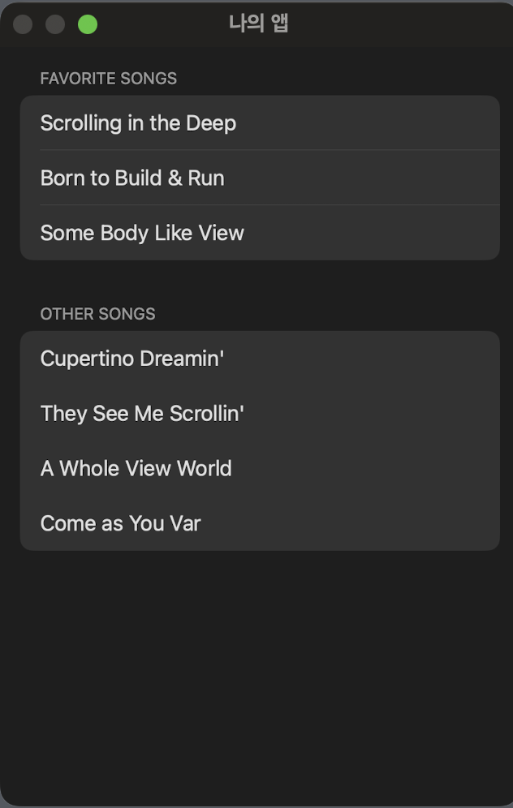

## 유연한 커스텀 컨테이너 뷰 만들기

근데 List를 아무리 잘 알아봐야.. 대부분 저렇게 디자인 안나와서 못씁니다!!

우리는 커스텀이 필요한데 여기서 유연한 커스텀 컨테이너 뷰를 만드는 방법을 알려준다고 합니다! 정확한 번역으로

> ‘몇 가지 새 API를 활용하여 이러한 기능을 모두 지원할 수 있는 Custom ContainerView를 빌드하는 방법을 설명해주겠다’ 라고 합니다.
> 

Composition - 유연성을 극대화한 커스텀 컨테이너 만드는 방법

Section - 섹션에 대한 기능을 지원하는 방법

Customization - Container안의 Content를 꾸미기 위한 수정자 정의하는 방법

### Composition

Container는 유연한 구성을 지원해야합니다. 무슨 의미인지는 위 List의 기본 사용법을 보면 알 수 있습니다

```swift
// 하드 코딩으로 정적인 리스트 표현
List {
		Text("Scrolling in the Deep")
    Text("Born to Build & Run")
    Text("Some Body Like View")
}

// 이니셜라이저로 동적인 리스트 표현
List(otherSongs) { song in
		Text(song)
}

// ForEach를 사용해 동적인 리스트 표현
List { 
		ForEach(otherSongs) { song in 
				Text(song)
		}
}

// 정적 + 동적인 리스트 동시에 표현
List {
		ForEach(otherSongs) { song in 
				Text(song)
		}

		Text("Scrolling in the Deep")
    Text("Born to Build & Run")
    Text("Some Body Like View")
}
```

정적으로 구성할 수도 있고 동적으로 구성할 수도 있고 정적 + 동적으로 구성할 수도 있습니다. 우리가 만들 커스텀 뷰 컬렉션 뷰는 이처럼 유연한 구성을 지원하고 싶습니다.

우리가 만들어야할 화면입니다.

CardView와

DisplayBoardView로 이루어져 있습니다.

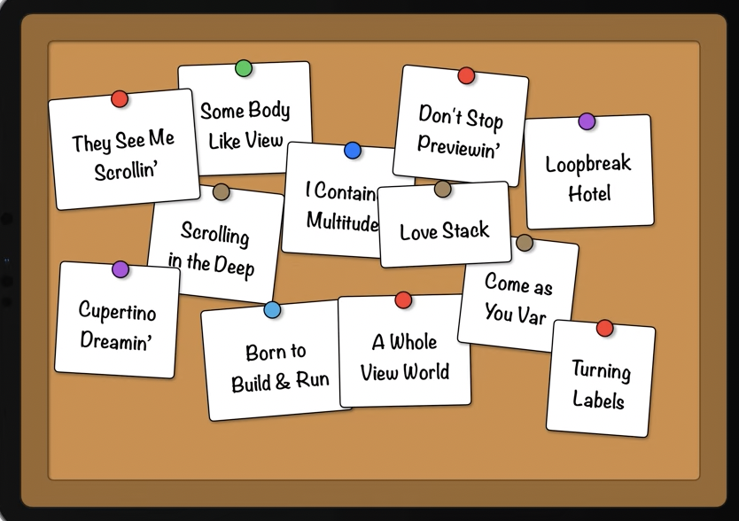

```swift
struct DisplayBoard<Data: RandomAccessCollection, Content: View>: View
    where Data.Element: Identifiable {
    var data: Data

    var content: (Data.Element) -> Content

    init(
        _ data: Data,
        @ViewBuilder content: @escaping (Data.Element) -> Content
    ) {
        self.data = data
        self.content = content
    }

    var body: some View {
        DisplayBoardCardLayout {
            ForEach(data) { item in
                CardView {
                    content(item)
                }
            }
        }
        .padding(66)
        .background { DisplayBoardBackgroundView() }
    }
}
```

 

- **질문 1.** 위 코드는 Display Board에 대한 코드 입니다. 무엇이 문제일까요??
    
    하나의 데이터 컬렉션만 사용하여 카드를 생성할 수 있으므로 창의력을 발휘하는 데 한계가 있죠
    
- **질문 2.** 그러면 어떻게 개선해야 할까요?
    
    ```swift
    struct DisplayBoard<Content: View>: View {
        @ViewBuilder var content: Content
    
        var body: some View {
            DisplayBoardCardLayout {
                ForEach(subviewOf: content) { subview in // ✅ New API - ForEach(subviewOf:)
                    CardView {
                        subview
                    }
                }
            }
            .padding(66)
            .background { DisplayBoardBackgroundView() }
        }
    }
    ```
    
    데이터 기반의 Property를 하나의 일반적인 View Property로 대체합니다. 하나의 데이터배열만 나타낼 수 있었던 전과는 다르게 서브뷰들을 받아 나열할 수 있게 됐습니다.
    
    그리고 iOS 18의 새로운 API ForEach(subviewOf:)는 View타입을 입력으로 허용하고 그 View의 각 하위 뷰를 다시 Trailing ViewBuilder Closure로 전달하여 새롭게 뷰를 그릴 수 있게 해줍니다.
    

.

.

.

### ✅iOS 18 New API - ForEach(subviewOf:)

ForEach(subviewOf:) API에 대해 더 자세히 알아봅시다.

```swift
DisplayBoard {
	  Text("Scrolling in the Deep")
	  Text("Born to Build & Run")
	  Text("Some Body Like View")

		// songsFromSam는 Song타입 배열이며 9의 크기를 가진다는 가정
	  ForEach(songsFromSam) { song in
		    Text(song.title)
	  }
}
```

Q. 위 DisplayBoard의 하위뷰는 몇 개 일까요??
    
A. 상황에 따라 다릅니다. <br>
선언형 하위 뷰(**Declarative subview) - 4개**<br>
해결된 하위 뷰 (**Resolved subviews) - 12개**
    
두 가지 SubView의 차이점을 이해하는 것이 중요합니다.

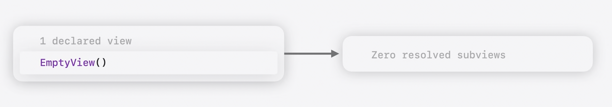


SwiftUI의 선언형 시스템에서 **Declarative subview는 SwiftUI 앱이 실행되는 동안 Resolved subviews를 생성하기 위한 방법을 정의 합니다.**

예를 들어, ForEach View는 시각적 형상이나 동작이 없는 선언형 SubView입니다. 대신 ForEach View의 유일한 목적은 Resolved Subview를 생성하는 것입니다.

또 다른 예로는 Group View가 있습니다. 이 또한 Resolved Subview를 생성하는데 목적이 있습니다.

```swift
// 1 declared view
Group {
  Text("Scrolling in the Deep")
  Text("Born to Build & Run")
  Text("Some Body Like View")
}

// 3 resolved subviews
Text("Scrolling in the Deep")

Text("Born to Build & Run")

Text("Some Body Like View")
```


Empty View같은 일부 **Declarative subview의 경우 Resolved subview를 하나도 생성하지 않을 수 있습니다.**

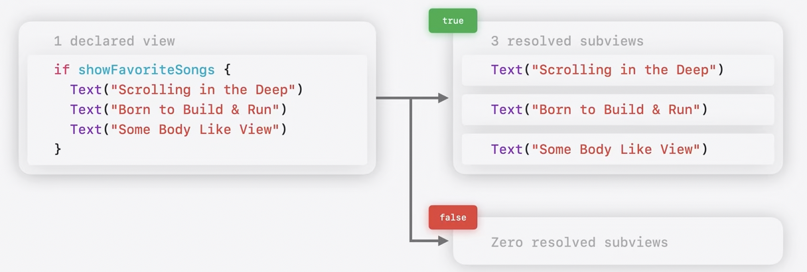

또는 조건부로 다른 개수의 하위 보기로 해결될 수 있습니다 if 구문의 다양한 분기문처럼요

새로운 ForEach(subviewOf:) API는 콘텐츠에서 **Resolved subview**만 반복합니다

### ✅iOS 18 New API - Group(subviewOf:)

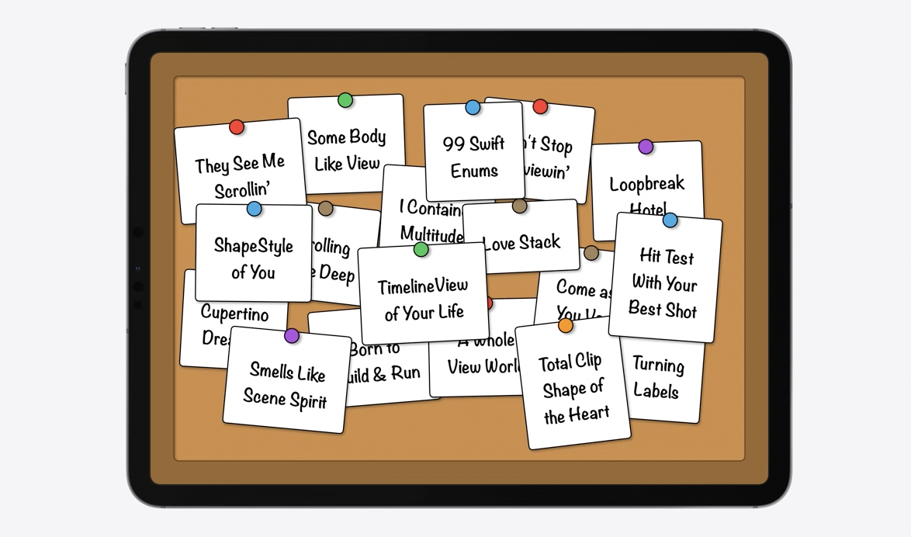

유연한 구조로 바꿨더니 추가가 너무 쉬워서 카드가 너무 많아졌습니다. 보기가 어려워요!!

새로운 API인 Group(subviewsOf:)를 이용해 15개 이상의 카드가 존재하면 크기가 작아지도록 하겠습니다.

```swift
@ViewBuilder var content: Content

var body: some View {
	  DisplayBoardCardLayout {
		    Group(subviewsOf: content) { subviews in
			      ForEach(subviews) { subview in
				        CardView(
					          scale: subviews.count > 15 ? .small : .normal
				        ) {
						          subview
				        }
			      }
		    }
		 }
	  .background { BoardBackgroundView() }
}
```

아까 설명한 ForEach(subviewOf:) API와 마찬가지로 View타입을 입력으로 허용하고 해당 View의 Resolved Suview를 생성합니다. 차이점은 한 번에 하나씩 반복하는 것이 아니라 Subviews 컬렉션을 다시 전달합니다.

## Section

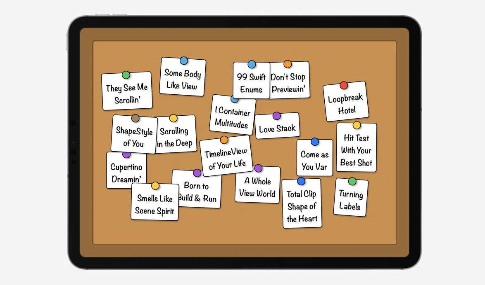

개수가 많아지면 작아져서 카드가 이전보다 덜 겹치긴 하나 여전히 정리되지 않은 느낌입니다.

섹션에 대한 기능 지원을 추가해 정리를 해보겠습니다.

```swift
List {
	  Section("Favorite Songs") {
		    Text("Scrolling in the Deep")
		    Text("Born to Build & Run")
		    Text("Some Body Like View")
	  }

	  Section("Other Songs") {
		    ForEach(otherSongs) { song in
			      Text(song.title)
	    }
	  }
}
```

List는 기본적으로 Section을 지원하는 내장 컨테이너 입니다. Group View와 유사하지만 Header와 Footer등섹션별 메타데이터를 추가로 사용할 수 있습니다. 하지만 우리가 사용하는 커스텀 컬렉션 뷰는 직접 추가 작업을 해주어야 합니다.

HStack을 이용해 게시판을 열로 섹션을 나누겠습니다.

1. 기존의 DisplayBoardCardLayout뷰를 개별 View로 분리하겠습니다.

```swift
@ViewBuilder var content: Content

var body: some View {
		// ✅ 이 부분을 따로 개별 뷰로 뺌
	  DisplayBoardCardLayout {
		    Group(subviewsOf: content) { subviews in
			      ForEach(subviews) { subview in
				        CardView(
					          scale: subviews.count > 15 ? .small : .normal
				        ) {
						          subview
				        }
			      }
		    }
		 }
		 // ✅ 여기까지
	  .background { BoardBackgroundView() }
}

->

@ViewBuilder var content: Content

var body: some View {
	  DisplayBoardSectionContent {
		    content
	  }
	  .background { BoardBackgroundView() }
}

struct DisplayBoardSectionContent<Content: View>: View {
	  @ViewBuilder var content: Content
	  ...
}
```

1. HStack을 이용해 열로 나누는데 이 때 새로운 API ForEach(sectionOf:)를 사용합니다.

```swift
@ViewBuilder var content: Content

var body: some View {
	  HStack(spacing: 80) {
		    ForEach(sectionOf: content) { section in // ✅ iOS18 New API ForEach(sectionOf:)
			      DisplayBoardSectionContent {
				        section.content
			      }
			      .background { BoardSectionBackgroundView() }
		    }
	  }
	  .background { BoardBackgroundView() }
}
```

ForEach(sectionOf:)는 ForEach(subviewOf:)와 마찬가지로 View를 입력으로 받고 View 내에 감지되는 각 Section을 반복하면서 ViewBuild에 Section Configuration을 제공합니다.

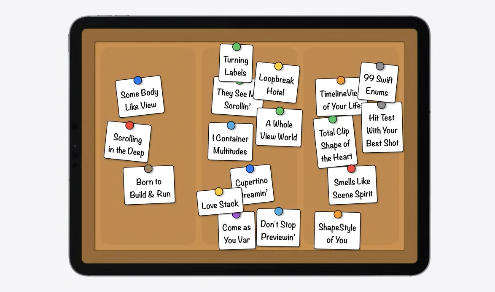

1. Header를 추가합니다.

```swift
@ViewBuilder var content: Content

var body: some View {
	  HStack(spacing: 80) {
		    ForEach(sectionOf: content) { section in // ✅ iOS18 New API ForEach(sectionOf:)
				    VStack(spacing: 20) {
						    if !section.header.isEmpty {
					          DisplayBoardSectionHeaderCard { section.header }
				        } 
					      DisplayBoardSectionContent {
						        section.content
					      }
					      .background { BoardSectionBackgroundView() }
				    }
		    }
	  }
	  .background { BoardBackgroundView() }
}
```

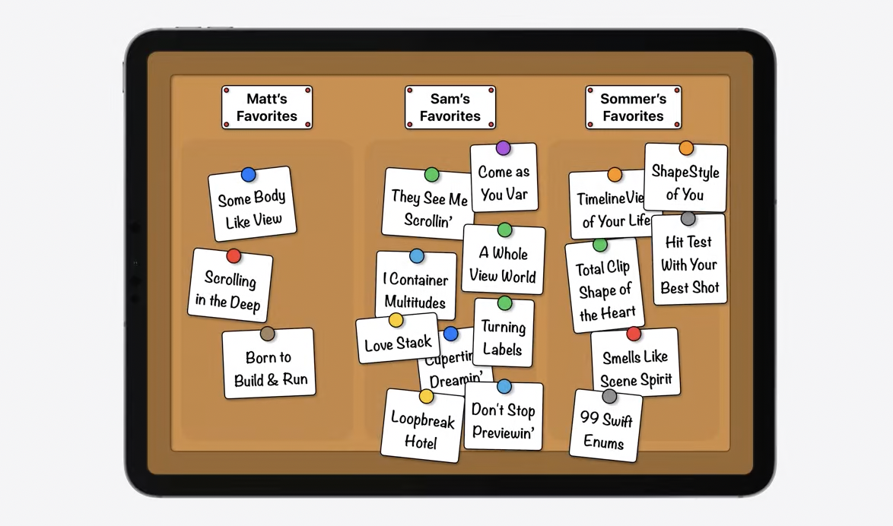

사용은 단순합니다.

```swift
List {
	  Section("Favorite Songs") { // ✅ 섹션 감지
		    Text("Scrolling in the Deep")
		    Text("Born to Build & Run")
		    Text("Some Body Like View")
	  }

	  Section("Other Songs") { // ✅ 섹션 감지
		    ForEach(otherSongs) { song in
			      Text(song.title)
		    }
	  }
}
```

## Customization

.listRowSeparator(.hidden)같은 커스텀할 수 있는 기능을 제공해봅시다. 우리는 부르지 않기로 결정한 노래는 줄을 그어 표시해주고 싶습니다. 이럴때 컨테이너별 한정자를 빌드하기 위한 새 API가 있습니다. 

### ✅ iOS 18 New API - Container Value [공식문서](https://developer.apple.com/documentation/swiftui/containervalues)

**Container Value는 Environment 및 Preferences와 유사한 키 저장소 값입니다.**

Preference values와 Environment values, Container values 각각의 값의 흐름을 비교하며 Container Values가 어떤 키 저장소이고 어떤때에 사용하면 좋을지 알아보겠습니다.

아래와 같은 구조의 뷰 일때
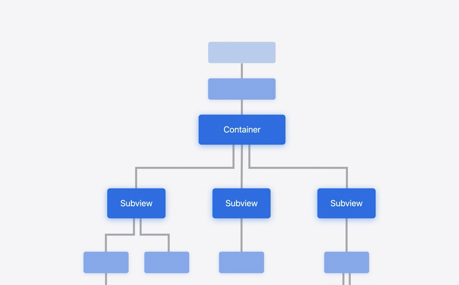


| Environment values | Preference values | Container values |
|----|----|----|
|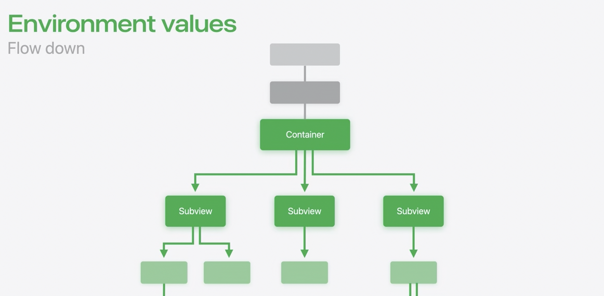| 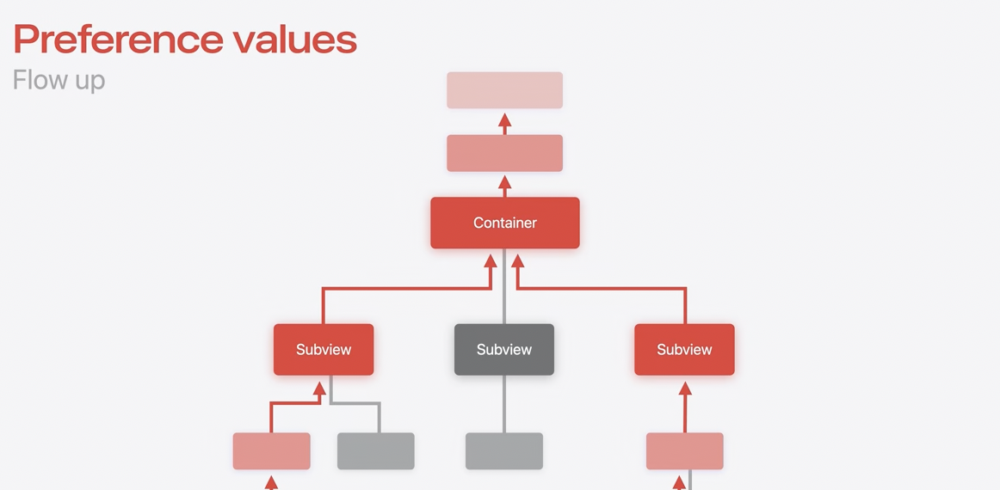| 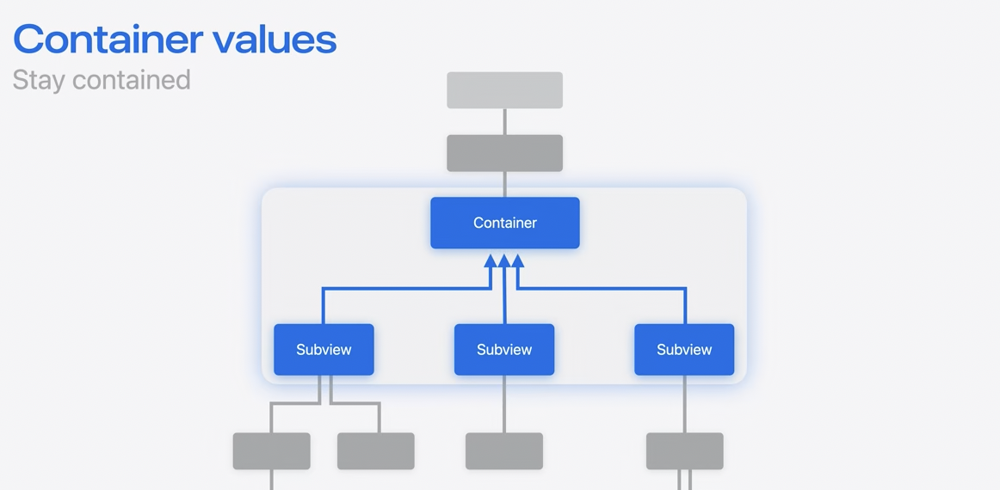
| 아래로 흐름 | 위로 흐름 | 위로 흐르지만 상위 레벨 하나 |


Preference values는 현재 레벨에서 모든 상위 레벨의 뷰에 값을 전달하는 Flow up흐름을 가지며 반대로 Environment values는 현재 레벨에서 모든 하위 레벨의 뷰에 값을 전달하는 Flow down의 흐름을 가집니다.

마지막으로 우리가 알아볼 Container Values는 Flow up의 흐름을 가지지만 바로 위의 상위 레벨까지만 값을 전달합니다.

Resolved Subview의 Container Values는 직접 컨테이너를 통해서만 접근할 수 있습니다. 그래서 컨테이너별 맞춤화 옵션을 구현할때 유용합니다.

이 부분은 WWDC 예제가 아닌 직접 테스트 해본 코드로 변경해서 설명드리겠습니다.

1. Container Value 사용하는 방법은 간단합니다.

```swift
// 1. ContainerValues를 확장해서 사용하고자 하는 키 값을 @Entry 매크로로 기본값과 함께 선언
extension ContainerValues {
    @Entry var isHighlight: Bool = false
    @Entry var isBoldFont: Bool = false
}

// 2. (선택 사항) 사용하기 편하게 View를 확장해 모디파이어를 추가해준다. 그냥 사용해도 무관함
extension View {
	  func displayBoardCardRejected(_ isRejected: Bool) -> some View {
		    containerValue(\.isDisplayBoardCardRejected, isRejected)
	  }
}
```

@Entry 매크로는 environment 값, focus 값 등 SwiftUI 키 저장소 유형에 새 값을 추가할 때 편리한 구문을 제공합니다.

1. ContainerValue를 이용한 Container 내부 구현 로직

```swift
struct NewContainerView<Content: View>: View {
    @ViewBuilder var contents: Content
    
    var body: some View {
        VStack(spacing: 24) {
            ForEach(sections: contents) { configure in
                let isSectionHighlight = configure.containerValues.isHighlight
                let isSectionBoldFont = configure.containerValues.isBoldFont
                
                VStack(spacing: .zero) {
                    /// header
                    if !configure.header.isEmpty {
                        configure.header
                            .frame(maxWidth: .infinity, alignment: .leading)
                            .font(.system(size: 20, weight: isSectionBoldFont ? .bold : .regular))
                            .foregroundStyle(isSectionHighlight ? .red : .black)
                    }
                    
                    /// content
                    ForEach(subviews: configure.content) { content in
                        let isBoldFont = content.containerValues.isBoldFont
                        let isHighlight = content.containerValues.isHighlight
                        
                        content
                            .frame(maxWidth: .infinity, alignment: .leading)
                            .foregroundStyle(isHighlight ? .red : .black)
                            .font(.system(size: 16, weight: isBoldFont ? .bold : .regular))
                    }
                }
                .padding()
                .background(Color.black.opacity(0.02))
                .clipShape(.rect(cornerRadius: 16))
            }
        }
        .padding()
    }
}
```

위에서 배웠기도 하고 iOS 18에서 새로 제공된 API인 ForEach(sections:) ForEach(subviews:) 를 사용합니다.

각각의 클로저에 주어지는 매개변수 타입은 각각 `SectionConfiguration` 와 `Subview` 으로 주어지며 해당 객체의 선언으로 가 적혀있는 주석을 확인해보면 각 내용이 다음과 같습니다.

```swift
/// An opaque value representing a subview of another view.
///
/// Access to a `Subview` can be obtained by using `ForEach(subviews:)` or
/// `Group(subviews:)`.
///
/// Subviews are proxies to the resolved view they represent, meaning
/// that modifiers applied to the original view will be applied before
/// modifiers applied to the subview, and the view is resolved
/// using the environment of its container, *not* the environment of the
/// its subview proxy. Additionally, because subviews must represent a
/// single leaf view, or container, a subview may represent a view after the
/// application of styles. As such, attempting to apply a style to it may
/// have no affect.
@available(iOS 18.0, macOS 15.0, tvOS 18.0, watchOS 11.0, visionOS 2.0, *)
public struct Subview : View, Identifiable {

    /// The container values associated with the given subview.
    public var containerValues: ContainerValues { get }
		...
}
```

```swift
/// Here, we want to create one view for `PinboardSectionsLayout` to place per
/// section in content. To do that, we surround the `ForEach` body in another
/// container, a `VStack` layout, ensuring the different subviews of
/// section.content are treated as a single view by the surrounding layout.
/// Additionally, surrounding the header and footer in an `HStack` layout
/// avoids vertically stacking subviews of the header and footer
/// which we want visually grouped together.
@available(iOS 18.0, macOS 15.0, tvOS 18.0, watchOS 11.0, visionOS 2.0, *)
public struct SectionConfiguration : Identifiable {

		/// The container values associated with the given section.
    ///
    /// Only explicitly created sections are able to have container values,
    /// meaning this container values will be empty if the section is implicit.
    public var containerValues: ContainerValues { get }
		...
}
```

위 주석들에서 읽어볼 수 있듯이  각 타입은 containerValues에 접근해 하위레벨의 뷰에서 설정한 키 값에 따라 상위 레벨의 컨테이너에서 뷰를 유연하게 구성할 수 있습니다.

1. Container View 객체 생성 및 ContainerValue 설정

```swift
    NewContainerView {
        Section("첫 섹션") {
            Text("첫 번째 컴포넌트")
                .highlight(true) // SubView Container 통해서만 접근 가능한 ContainerValue
                .setBold(true) // SubView Container 통해서만 접근 가능한 ContainerValue
        }
        .highlight(true) // Section Container 통해서만 접근 가능한 ContainerValue
        
        Section("두 번째 섹션") {
            Text("두 번째 컴포넌트")
                .highlight(true)
                .setBold(true)
        }
        
        VStack(spacing: .zero) { // SubView Container 통해서만 접근 가능한 ContainerValue
            Text("세 번째 컴포넌트") // VStack Container로 감싸서 NewContainerView의 Subview가 아니므로 ContainerValue를 설정해줘도 동작 안함
                .setBold(true)
                .highlight(true)
        } // 여기에 모디파이어 추가해서 ContainerValue 변경해주면 동작함
//        .setBold(true)
        
        Text("네 번째 컴포넌트")
            .highlight(false)
        Text("다섯 번째 컴포넌트")
            .highlight(true)
    }
```

Container Vlaue 적용 코드 결과 화면

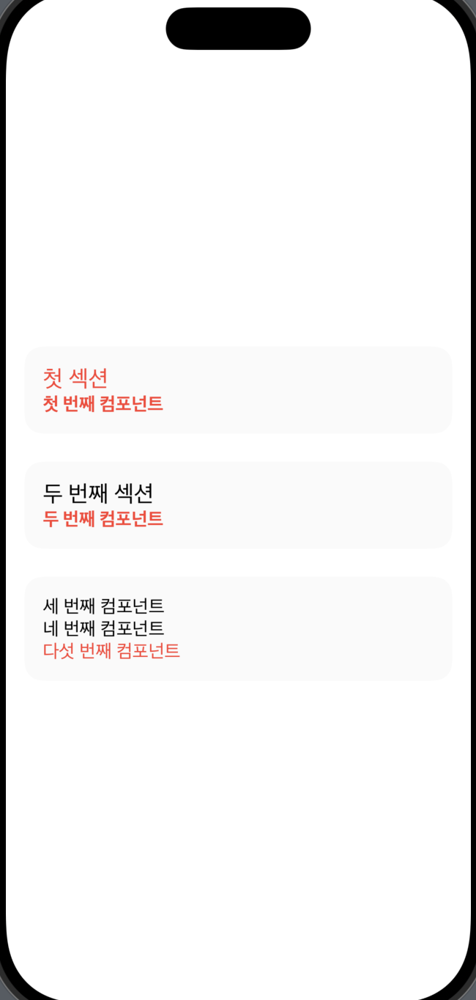
