# [WWDC2023] Discover Observation in SwiftUI


오늘의 주제는 ObservableObject 프로토콜과 @Observable 매크로의 차이를 비교해보고 @Observable로 마이그레이션 하는 편이 좋을지 판단해보고 싶어 선택하게 되었습니다.

## What is Observation?

ObservableObject + @Published를 대체하여

프로퍼티의 변화를 추적하는 Swift의 새로운 기능입니다.

Swift의 평범한 타입을 매크로를 통해 관찰 가능한 객체로 변경할 수 있습니다.

WWDC에서 제공해주는 예시를 함께 보면서 이해해보겠습니다.

다음과 같은 데이터 모델이 있습니다.

```swift
class FoodTruckModel {
		var orders: [Order] = []
		var donuts = Donut.all
}
```

데이터 모델은 시시각각 변하고 그에 따라 UI를 업데이트 해줘야함 →

값은 변했지만 UI업데이트 부분을 호출하지 않는 휴먼 에러가 발생함 → 

RxSwift나 Combine 을 이용해 값에 바인딩을 도와주는 라이브러리를 사용함 →

처음에 배우고 사용하기 어려운 단점이 존재함 →

내부적으로 Combine을 사용하는 ObservableObject + @Published를 제거하고

Swift5.9에서는 @Observable 매크로를 이용해 단순해짐

```swift
@Observable class FoodTruckModel {
		var orders: [Order] = []
		var donuts = Donut.all
}
```

Swift 매크로를 활용한 @Observable 하나만으로 우리 FoodTruckModel 객체의 변화를 관찰할 수 있게됨

@Observable은 Swift 컴파일러에 명령을 내려서 여러분이 작성한 모델 코드를 Observable 타입으로 확장 가능합니다.

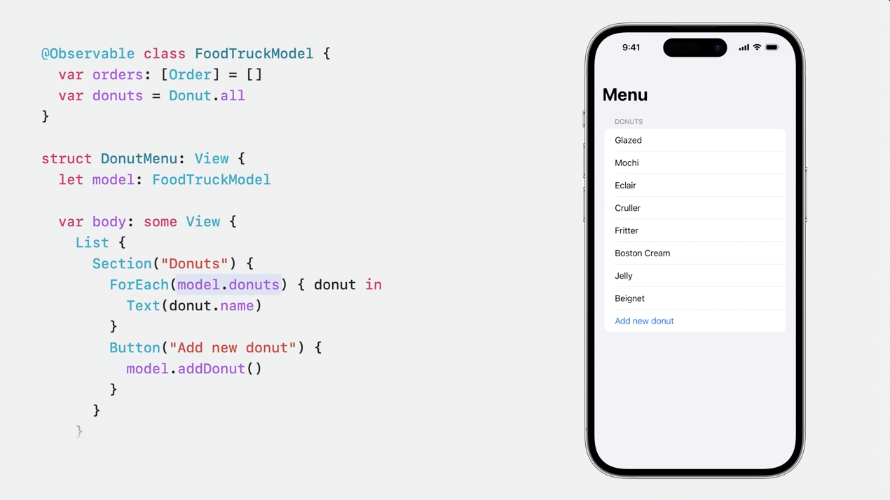

FoodTruckModel모델의 도넛 목록을 보여주는 간단한 예시입니다.

View가 body를 호출할때 Observable에서 사용된 프로퍼티의 모든 접근을 추적합니다. (저장프로퍼티나 연산프로퍼티 모두) 그리고 이 추적 정보를 이용해 특정 인스턴스에서 다음프로퍼티 변화가 언제 일어날지를 예측합니다. 

위 코드를 예시로 다시 위의 말이 무슨 뜻인지 해석해보겠습니다.

DonutMenu는 View를 그리기 위해 body를 실행 →

Observable로 관리되는 FoodTruckModel에서 donuts 변수에 접근 및 추적 →

Add New donut 버튼을 누르면 donuts 배열에 새로운 도넛 추가 →

현재 DonutMenu View 무효화 → DonutMenuView Update

여기서 핵심은 사용되지 않는 orders가 추가되었을 때는 뷰가 무효화 되지 않는다는 점입니다.

왜냐면 orders는 View가 body를 실행할때 접근/추적했던 프로퍼티가 아니었기 때문입니다.

**즉, body 외에 어딘가에서 같은 모델의 인스턴스를 가지고 orders를 변경해도 DonutMenu는 뷰를 다시 그리지 않습니다.**

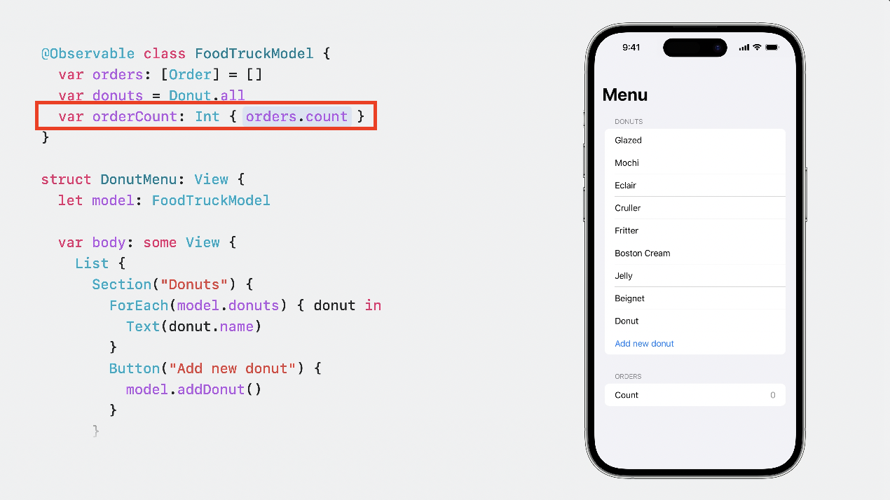

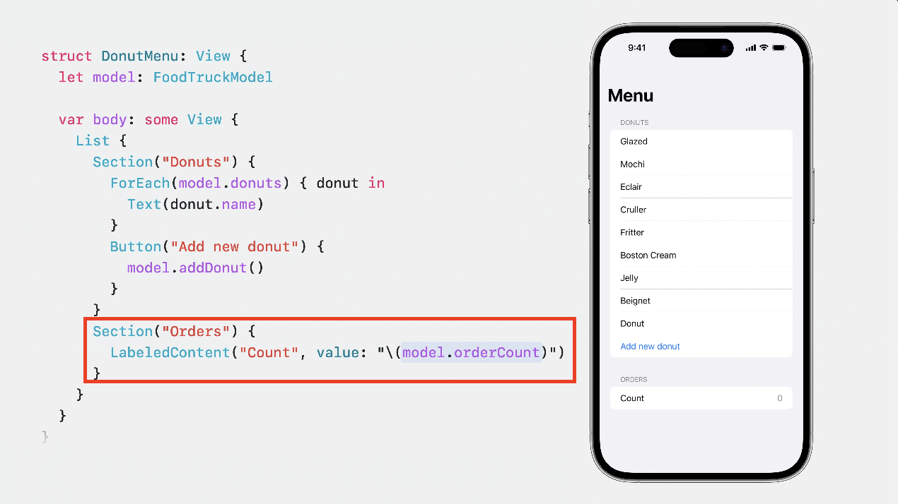

@Obsrvable로 관리하는 FoodTruckModel에 orderCount 연산 프로퍼티를 추가하고 orderCount를 사용해 뷰를 그려보겠습니다.

이렇게 되면 orders 프로퍼티가 변경됐을때 donuts 프로퍼티와 마찬가지로 뷰가 무효화되고 UI가 업데이트 됩니다. orderCount가 orders프로퍼티에 접근했기 때문입니다!

### 관찰하고싶지 않은 프로퍼티 제외하기

- @ObservationIgnored 사용하기

```swift

@Observable class FoodTruckModel {
		@ObservationIgnored var orders: [Order] = []
		var donuts = Donut.all
}

```

## SwiftUI property wrappers

SwiftUI로 UI를 그릴때 @Observable과 함께 사용하면 좋은 Property wrappers 3가지

- State
- Environment
- Bindable

### @State

model안에 view 전용 상태를 저장해야할 때 사용합니다.

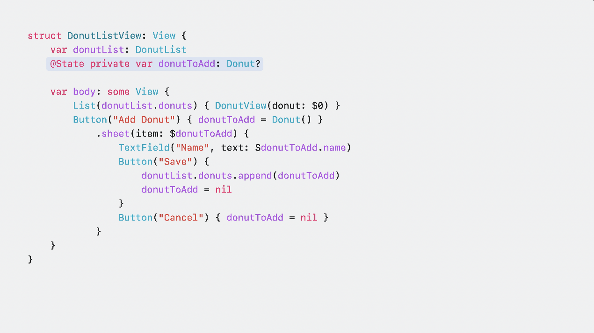

## @Environment

Environment는 각 값을 어디에서든 접근 할 수 있게 해줍니다. 여러 곳에서 공유가 가능해집니다.

Observable타입과 아주 잘 맞는데 그 이유는 Observable이 접근을 추적해서 UI를 업데이트 해주기 때문에 일관성이 지켜져서 여러 곳에서 공유할때 아주 좋다고 합니다!

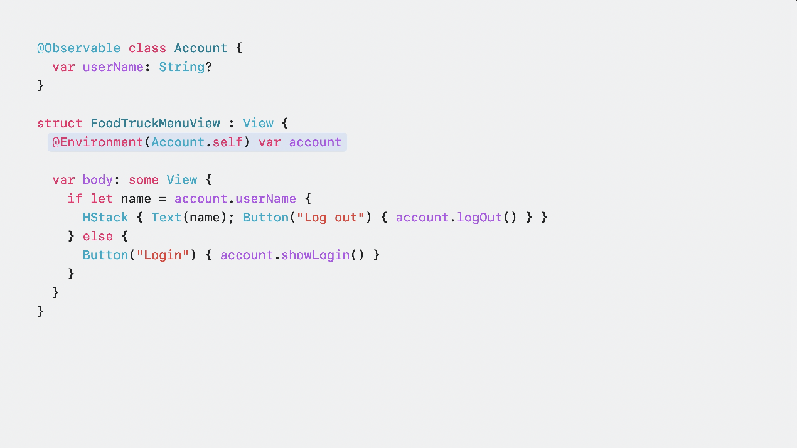

+) Environment에서는 더욱 성능향상을 가져가지 않을까 생각합니다. 여러 하위 뷰에 공유된 상황에 프로퍼티가 업데이트 된다고 모든 뷰를 업데이트하는 것보다 body에서 접근하는 View만 업데이트해서 성능면에 아주 👍

### @Bindable

- 2023년 WWDC기준 가장 최근 추가된 프로퍼티 래퍼
- 해당 타입으로부터 바인딩이 생성되게 하는 기능만 존재 → 굉장히 가벼움
- @Bindable을 프로퍼티 앞에 붙이기

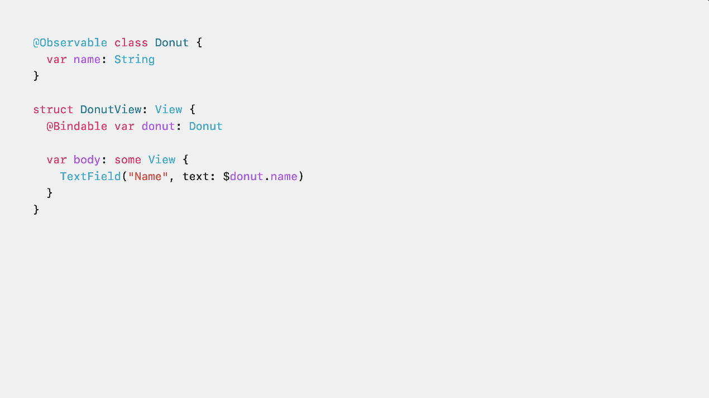

TextField에서 바인딩객체가 필요합니다.

우리 Donut은 @Observable로 관리하고 있어서 프로퍼티 안붙여도 되는데!?

바인딩을 읽어 텍스트필드 값을 채우기도 하고 사용자가 값을 변경하면 바인딩에 회신하기도 합니다.

SwiftUI의 Observable 모델을 사용하는데 있어서 대답해야 할 질문은 딱 세가지입니다.

1. 이 모델이 뷰상태로 있어야 하는가? → @State
2. 이 모델이 전역 환경의 일부여야 하나? → @Environment
3. 이 모델에는 바인딩이 필요한가? → @Bindable

3가지 모두 포함하지 않는다면 일반 프로퍼티로 사용하시면 됩니다.

## Advanced Uses

지금까진 모델에 저장되어 있는 프로퍼티를 다뤄 보았는데 Observable은 더 다양한 기능이 있습니다.

OservableObject와는 다르게 배열과 옵셔널도 사용할 수 있으며 @Observable이 포함된 어느 타입이든 사용이 가능 합니다.

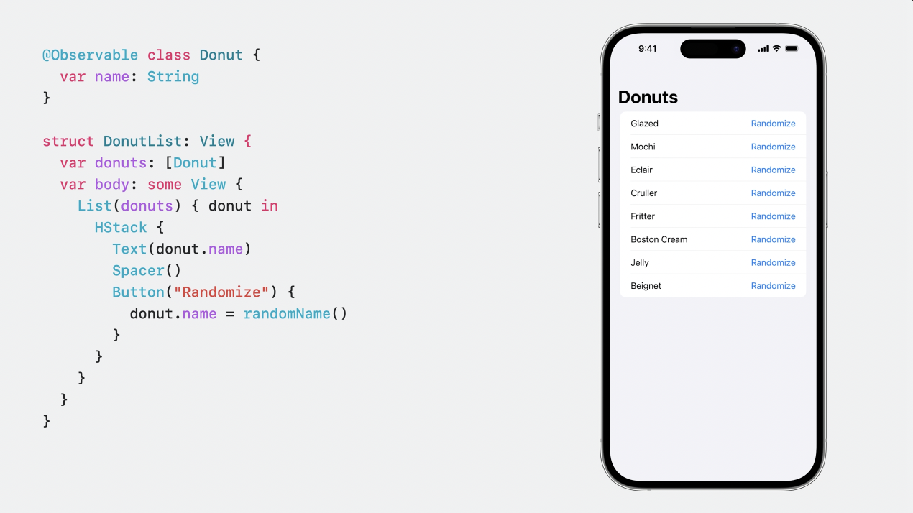

ObsrvableObject를 배열 or 옵셔널로 사용하려는 경우 에러 발생

```swift
@StateObject var models: [FoodTruckModelUsedProtocol] // Generic struct 'StateObject' requires that '[FoodTruckModelUsedProtocol]' conform to 'ObservableObject'

@StateObject var model: FoodTruckModelUsedProtocol? // Generic struct 'StateObject' requires that 'FoodTruckModelUsedProtocol?' conform to 'ObservableObject'
```

**Observation의 기본 규칙은 사용중인 프로퍼티가 변경되면 변경된 프로퍼티에 접근하는 뷰도 업데이트 된다 입니다.**

하지만 드물게 예외의 경우도 존재한다고 합니다.

```swift
@Observable
class Profile {
    var firstName: String = ""
    var lastName: String = ""

    var fullName: String {
        "\(firstName) \(lastName)"
    }
}
```

View에서 fullName에만 접근하는 경우 추적이 될 수도 있고 안 될 수도 있다? 😲

테스트 결과 위 코드는 정상 동작합니다. 그럼, 어떤 경우가 안되는거냐?? 위와 같은 상황에서 fullName 프로퍼티가 내부에서 외부 함수도 호출하고 여러가지 복잡한 작업을 할 때 내부연산을 놓칠 수 있는 상황이 생길 수 있다고 합니다.

위와 같이 예외의 상황이 생길경우 또는 고급 커스텀 기능이 필요한경우에는 Observation 커스텀이 가능합니다.

WWDC에서는 아래와 같은 경우 사용하라고 말합니다.

‘관찰 대상인 프로퍼티가 Obsrvable 타입에 저장된 멤버에 의해 변경되지 않았을 때만 필요한 조치’

이 경우 프로퍼티에 접근과 변경이 언제 이루어졌는지 Observation에 전달해주기만 하면 됩니다.

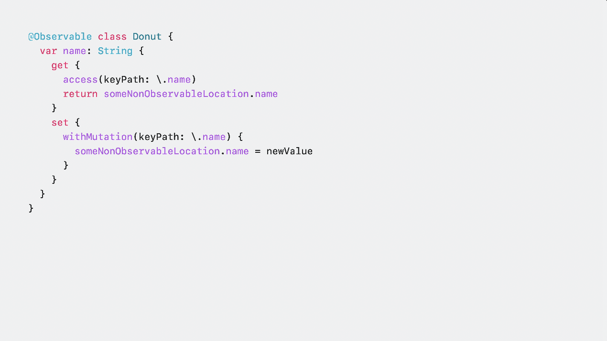

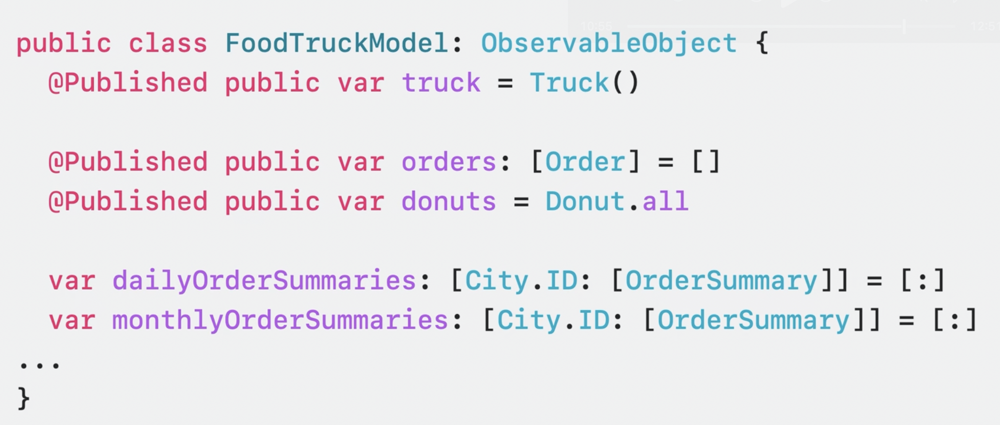

- access(_: keyPath:)로 접근 시점 Observation에게 전달
- willSet(_: keyPath:)로 값 변경시점 직전에 호출
- didSet(_: keyPath:)로 값 변경시점 직후에 호출
- withMutation(_: keyPath:, )을 통해 변경시점을 Observation에게 전달 → 변경 이전에 willSet 호출하고 변경 후 didSet을 호출

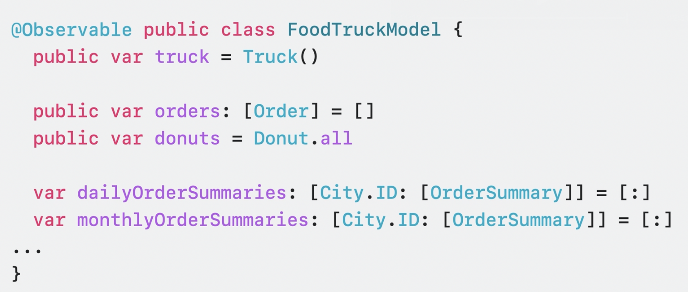

곧 예제 앱을 통해 보겠지만 아래 코드와 같이 구현해주면 정상적으로 동작했습니다.

```swift
import Foundation
import Observation

final class ManualObservableModel: Observable {
    private var _orders: [Order] = []
    private var _donuts: [Donut] = [.blackRaspberry, .blueberryFrosted, .blueberryFrosted]
    
    var ordersCount: Int {
        registrar.access(self, keyPath: \._orders)
        return _orders.count
    }

    /// 옵저베이션 관리자
    private let registrar = ObservationRegistrar()

    var orders: [Order] {
        get {
            registrar.access(self, keyPath: \._orders)
            return _orders
        }
        set {
            _orders = newValue
            registrar.withMutation(of: self, keyPath: \._orders) {
                _orders = newValue
            }
        }
    }
    
    var donuts: [Donut] {
        get {
            registrar.access(self, keyPath: \._donuts)
            return _donuts
        }
        set {
            _donuts = newValue
            registrar.withMutation(of: self, keyPath: \._donuts) {
                _donuts = newValue
            }
        }
    }
}

extension ManualObservableModel {
    func addRandomDonut() {
        if let newDonut = Donut.all.randomElement() {
            donuts.append(newDonut)
        }
    }
    
    func addOrder() {
        if let newDonut1 = Donut.all.randomElement(),
           let newDonut2 = Donut.all.randomElement() {
            orders.append(.init(donuts: [newDonut1, newDonut2]))
        }
    }
}
```

- ObservationRegister - 데이터 변경 사항을 추적하고 액세스할 수 있는 저장소를 제공

### +)추가 궁금증 @Obsevable은 어떻게 동작할까?

컴파일 시점에 

- @ObservationTracked 어노테이션이 각 프로퍼티에 붙음
- withObservationTracking API가 내부적으로 추가되서 변경된 프로퍼티를 감지하고 업데이트
- 일반 개발자가 직접 쓸 필요는 없고, Swift의 @Observable 매크로 안에서 자동으로 사용

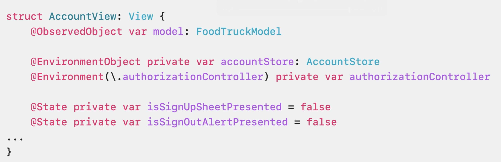

## ObservableObject

마지막으로 ObservableObject프로토콜을 사용했을때와 Obsevation을 사용했을때 View에서 코드의 차이를 보여주고 코드 간소화와 성능 향상의 장점까지도 간단히 말해주며 영상은 끝이 납니다. 

ObservableObject 사용하는 경우의 Model 또는 ViewModel Code

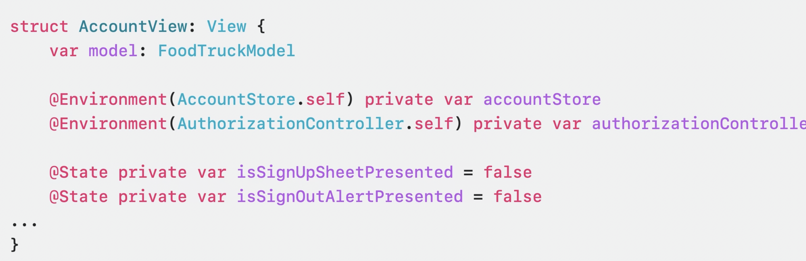

@Observable 매크로를 사용하는 경우 Model 또는 ViewModel Code

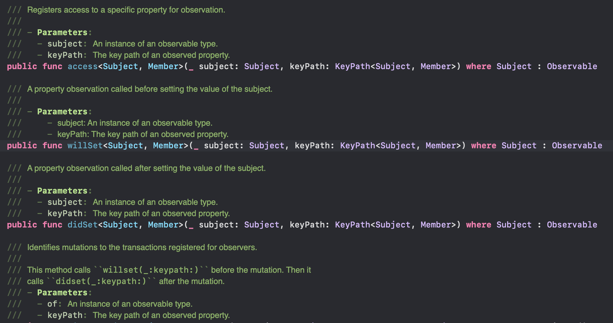

ObservableObject를 채택할 필요도 관찰할 프로퍼티에 @Published를 붙일 필요도 없어졌습니다.

ObservableObject로 사용하는경우 View Code

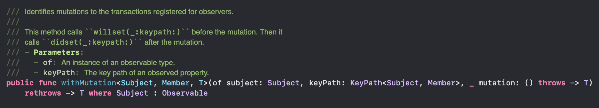

@Observable 매크로를 사용하는경우 View Code

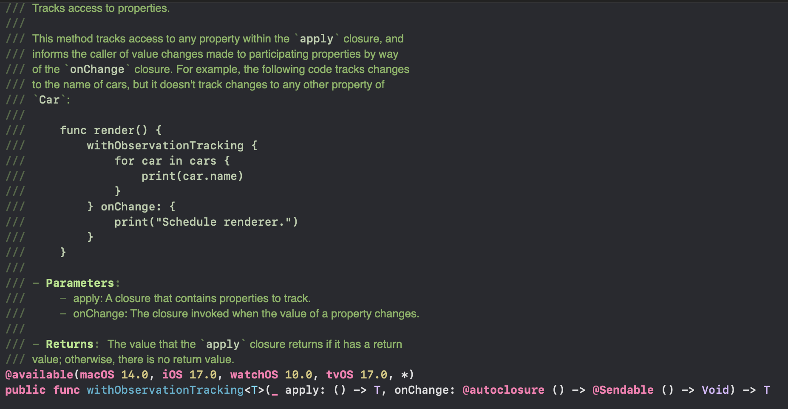

프로퍼티 래퍼가 줄어드는걸 볼 수 있습니다!!

### 장단점

빠질 수 없는 장점과 단점 비교

| 비교 대상 | ObservableObject | @Obsrvable(Observation) | 비고 |
| --- | --- | --- | --- |
| 성능 | ⬇️ | ⬆️ | 뷰에 접근하는 프로퍼티만 관찰해 뷰 업데이트로 성능 향상 |
| 코드 간소화 | ⬇️ | ⬆️ | @Published, @StateObject등 여러 어노테이션 감소 |
| 가용성 | Class만 가능 | struct, actor등 여러 타입 | Class 포함하여 여러 타입 적용 가능 |

단점 및 한계점 뭐가 있을까?

같이 찾아주세요 Mash-Up 멋쟁이분들 😎